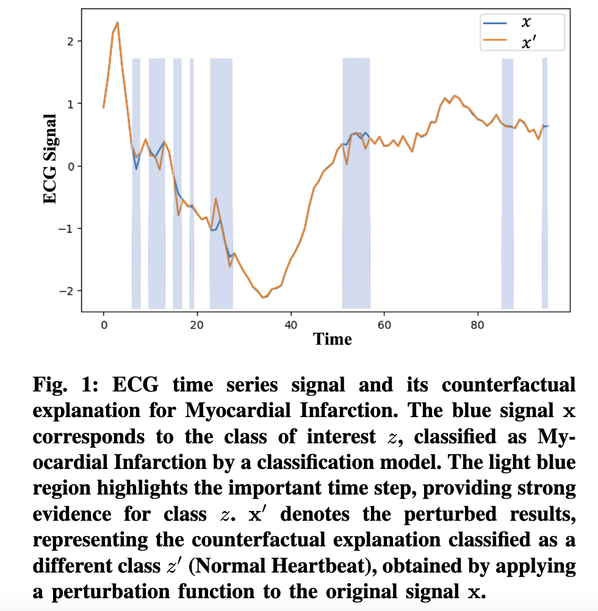
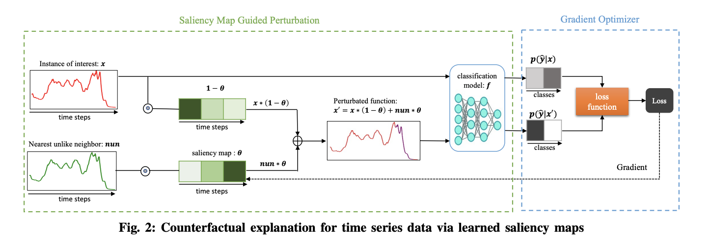

# Counterfactual Explanation for Time Series Data via Learned Saliency Maps
This is the repository for our paper titled "[CELS: Counterfactual Explanation for Time Series Data via Learned Saliency Maps](https://ieeexplore.ieee.org/document/10386229)". This paper has been accepted at the [2023 IEEE International Conference on Big Data (Big Data)](https://bigdataieee.org/BigData2023/)
 
# Approach

# Prerequisites and Instructions
All python packages needed are listed in [pip-requirements.txt](pip-requirements.txt) file and can be installed simply using the pip command.

# Data
The data used in this project comes from the [UCR](https://www.cs.ucr.edu/~eamonn/time_series_data_2018/) archive.
